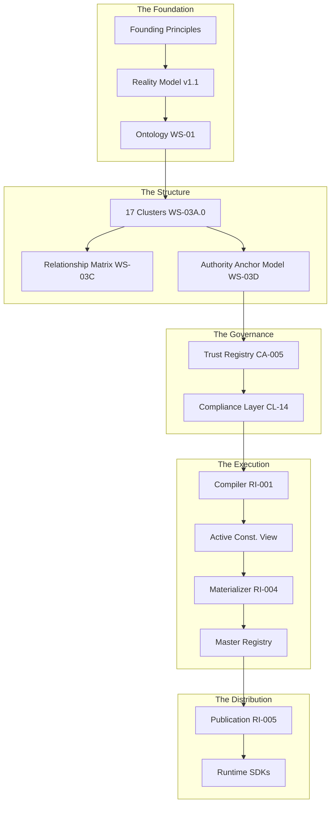

# ZYPPI CONSTITUTIONAL STATE OF THE UNION (v1.1)
## The Authoritative Orientation & Onboarding Dossier for the AI Council
**Status:** Canonical Baseline
**Date:** June 2026
**Scope:** Repository Baseline v1.0 (Execution Era)

---

## 1. Executive Summary

### 1.1 Mission: Intent Distribution Infrastructure
Zyppi is the **Intent Distribution Infrastructure** for the physical internet (Ref: `NORTH-STAR.md`). It bridges the gap between physical interactions (**Touch**) and digital outcomes by preserving the **Asset Reality** across time, jurisdiction, and interface. Unlike legacy event-centric systems, Zyppi treats relationships as permanent and interactions as transient.

### 1.2 Constitution at a Glance (Repository Scale)
| Metric | Value | Authority |
| :--- | :--- | :--- |
| **Ratified/Locked Constitutions** | 59 | `constitution/ratified/` |
| **Constitutional Clusters** | 17 | `WS-03A.0` |
| **Active Amendments** | 6 | `CA-001` to `CA-005`, `A-001` |
| **Active Supersessions** | 15 | `SR-001` |
| **Execution Specifications** | 6 | `RI-000` to `RI-005` |
| **Compiler Stages** | 5 | `RI-000` Appendix B |
| **Reserved Domains** | 5 | `RSN-003` |
| **Overall Maturity** | 85% | Council Audit June 2026 |

---

## 2. Zyppi Constitutional Architecture Map

The following visual map defines the flow of authority and truth through the system.

---

## 3. Constitutional Layers

Reviewers should use this hierarchy to categorize all architectural inquiries.

| Layer | Purpose | Primary Responsibility |
| :--- | :--- | :--- |
| **Philosophy** | Why Zyppi exists | North Star, Founding Principles |
| **Reality** | What exists | Actors, Identities, Referents, Assets |
| **Structure** | How reality is organized | 17 Clusters, Single-Parent Taxonomy |
| **Governance** | Who controls reality | Authority Anchors, Trust Registry, Policy |
| **Execution** | How truth becomes executable | Compiler (RI-001), ACV, Population Plan |
| **Publication** | How truth is distributed | Registry Bundles, Merkle Proofs |
| **Runtime** | How apps consume truth | SDKs, Resolution Engines, Federation |

---

## 4. Constitutional Status Dashboard

Reviewers must focus effort on **DRAFT**, **IN PROGRESS**, or **GAP** areas. **LOCKED** areas are settled law.

| Domain | Status | Stability | Authority |
| :--- | :--- | :--- | :--- |
| **Ontology** | **LOCKED** | **Immutable** | `WS-01`, `WS-03F` |
| **Taxonomy** | **LOCKED** | **Stable** | `WS-03A.0`, `CA-001` |
| **Relationship Model** | **LOCKED** | **Stable** | `WS-04A.1`, `ARM-001` |
| **Authority Model** | **LOCKED** | **Stable** | `WS-03D`, `CA-004` |
| **Trust Registry** | **LOCKED** | **Stable** | `CA-005` |
| **Compiler / ACV** | **LOCKED** | **Stable** | `RI-000`, `RI-001` |
| **Population Engine** | **LOCKED** | **Stable** | `RI-004`, `WS-05A-E` |
| **Reasoning Framework** | **LOCKED** | **Stable** | `RSN-001`, `RSN-002` |
| **Registry Publication** | **DRAFT** | **Evolving** | `RI-005` |
| **Runtime SDK / API** | **IN PROGRESS**| **Experimental**| `ROADMAP.md` |
| **Policy Engine** | **GAP** | **Experimental**| `PRJ-001` §11 |
| **Federation** | **RESERVED** | **N/A** | `RSN-003` |

---

## 5. Stability Levels

Not all "Locked" documents possess the same evolutionary profile.

| Level | Meaning | Council Constraint |
| :--- | :--- | :--- |
| **Immutable** | Never changes. Foundational axioms. | Modification triggers Phase 0 Reset. |
| **Stable** | Changes only via Amendment. | High burden of proof for changes. |
| **Evolving** | Expected to grow as implementation scales. | Amendments are expected and routine. |
| **Experimental** | Prototype only. Not for production use. | Full redesign permitted without amendment. |

---

## 6. The Immutable Principles

### 6.1 Constitutional Principles (Meaning & Truth)
- **Reality Over Events:** Meaning compounds through relationships, not logs. (Ref: `ZRM v1.1`, §6.17)
- **Single Ownership Rule:** No concept may be owned by more than one cluster. (Ref: `WS-03A.0`, §5, CR-001)
- **Identity != Referent:** Digital representation (zID) is distinct from physical objects. (Ref: `WS-01`, §2)
- **Relationships First:** Relationships possess independent identity and lifecycle. (Ref: `ARM-001`)
- **Bitemporality:** Facts record both Occurrence and Assertion time. (Ref: `ZRM v1.1`, §3)

### 6.2 Technical Principles (Performance & Enforcement)
- **Traffic Is Sacred:** Redirect performance is the primary path. (Ref: `TECH-ARCHITECTURE.md`, §2)
- **Deterministic Compilation:** Identical inputs SHALL produce byte-identical artifacts. (Ref: `RI-000`, §85, Appx J)
- **Dumb Executor:** Registry Materializers make zero constitutional decisions. (Ref: `RI-004`, §CMP-001)
- **RFC 8785 Serialization:** Strict lexicographical sorting is mandatory. (Ref: `RI-001`, §28)
- **Merkle Verification:** Trust is derived from math, not transport. (Ref: `RI-005`, §3)

---

## 7. Constitutional Completeness Map

- **Reality (Assets, Events, Identities)**
  ██████████████ 100% (Foundations frozen under `CFR-001`)
- **Execution (Intents, Transactions, Outcomes)**
  █████████████░ 95% (Contracts defined; SDKs pending)
- **Compilation (ACV, Determinism, Proofs)**
  ██████████████ 100% (RI-000 through RI-004 ratified)
- **Interpretation (Reasoning, Intelligence)**
  ███████████░░░ 80% (Framework locked; Blueprints empty)
- **Projection (GS1, DPP, Views)**
  ██████████░░░░ 75% (Framework locked; Policy engine missing)
- **Runtime (SDK, Federation, Marketplace)**
  ██░░░░░░░░░░░░ 15% (Phase D roadmap only)

---

## 8. Constitutional Execution Pipeline

1.  **Frozen Constitution:** Ratified markdown corpus.
2.  **RI-001 Compiler:** Consumes corpus to build the **ACV**.
3.  **Active Constitutional View (ACV):** Sole executable representation of truth.
4.  **RI-003 Independent Proof:** Reconstructs truth to verify compiler correctness.
5.  **Population Plan:** Proven batch sequence for registry construction.
6.  **RI-004 Materialization:** "Dumb Executor" writes values to the registry.
7.  **Certified Registry:** Merkleized, certified, and immutable state.
8.  **RI-005 Publication:** Distribution of verified Registry Bundles.

---

## 9. Current Constitutional Boundary

The Constitution currently ends at **RI-005 Registry Publication**.

Everything after publication—including **Runtime Execution Engines**, **SDK implementations**, **API orchestration**, and **Federation protocols**—remains outside the current constitutional scope. These domains are **RESERVED** for future Council design work.

---

## 10. Constitutional Decision Register (Settled Debates)

Debates that **MUST NOT** be reopened without a formal Phase 0 Reset.

| Decision Point | Adopted Result | Rejected Alternative | Authority |
| :--- | :--- | :--- | :--- |
| **Cluster Count** | **17 Clusters** | 15 Clusters | `CA-001`, §1 |
| **Interaction Unit** | **Event** (CL-11) | Signal | `SR-007` |
| **Campaign Status** | **Identity+Context**| Core Primitive | `CA-002` |
| **Time Status** | **CL-13 Cluster** | Graph Metadata | `A-001` |
| **Inheritance Rule** | **Single-Parent** | Multiple Inheritance | `WS-03A.0`, §8 |
| **Context Model** | **Singular Anchor** | Composable Tags | `WS-03D` |
| **Registry Role** | **Materializer** | Registry Builder | `RI-004` |
| **Serialization** | **RFC 8785 JCS** | Standard JSON | `RI-001`, §28 |

---

## 11. Explicit "Do NOT Revisit" List (The Invariants)

Reviewers are strictly prohibited from proposing innovation in:
- **17-Cluster Taxonomy**
- **Single Ownership Rule**
- **Single-Parent Taxonomy**
- **Deterministic Compilation Chain**
- **Population Plan Theorem**
- **Registry Materialization Model** (Dumb Executor)
- **RFC 8785 Canonicalization**
- **Bitemporal Reality Invariants**
- **Reality-First Philosophy**

---

## 12. Debt & Risk Register

### 12.1 Constitutional Debt (Missing Specifications)
- **POL-001 (Policy):** PRJ/EXP lack a formal evaluation logic spec (Rego/CEL). (**CRITICAL**)
- **FED-001 (Federation):** No model for cross-tenant sharing. (**HIGH**)
- **SDK-001 (Runtime):** No execution contract for SDK consumers. (**HIGH**)

### 12.2 Architectural Debt (Implementation Gaps)
- **Blueprints:** Framework exists, but the Blueprint registry is empty.
- **KRM Schema:** Knowledge Routing Matrix referenced in RSN-001 has no schema.
- **Reference Compilers:** Go/Rust/Python implementations are "In Progress."

---

## 13. Next Constitutional Documents (Roadmap)

Expected sequence for extending the system beyond the Registry phase:
1. **POL-001:** Policy Evaluation & Logic Constitution.
2. **RI-006:** SDK Runtime Execution Contract.
3. **FED-001:** Cross-Tenant Federation Protocol.
4. **SEC-001:** Constitutional Security & Secret Management.
5. **MKT-001:** Intent & Blueprint Marketplace Governance.

---

## 14. Constitutional Maturity & Confidence

| Domain | Frozen | Proven | Implemented | Confidence |
| :--- | :--- | :--- | :--- | :--- |
| **Ontology** | ✓ | ✓ | ✓ | **Very High** |
| **Taxonomy** | ✓ | ✓ | ✓ | **Very High** |
| **Execution** | ✓ | ✓ | ✓ | **Very High** |
| **Compiler** | ✓ | ✓ | In Progress | **High** |
| **Publication** | ✗ | ✗ | ✗ | **Medium** |
| **Runtime** | ✗ | ✗ | ✗ | **Low** |

---

## 15. Ownership Map (Concept Sovereignty)

Every idea in Zyppi has exactly one owner (Ref: `WS-03A.0`, §5, CR-001).

| Concept | Unique Owner (Cluster) | Referenced By | Authority |
| :--- | :--- | :--- | :--- |
| **Reality State** | CL-17 Graph Core | RI-004, RI-005 | `WS-03A.0`, §10 |
| **Digital ID (zID)** | CL-04 Identity | All Layers | `WS-03A.2`, §1 |
| **Fact Assertion** | CL-11 Event | RSN, PRJ | `WS-03A.8`, §1 |
| **Inference/Risk** | CL-16 Intelligence | EXP, Decision Sys | `WS-03A.9`, §1 |
| **Auth Context** | CL-04 Identity | CA-004, CA-005 | `SR-012`, `WS-03F` |
| **Temporal Logic** | CL-13 Temporal | All Layers | `AMENDMENT A-001` |

---

## 16. AI Council Mandate: The Reviewer's Purpose

### 16.1 The Council IS responsible for:
- Detecting **contradictions** between constitutional layers.
- Identifying **missing** constitutional coverage (Gaps).
- Detecting **ambiguity** that prevents deterministic implementation.
- Enforcing the **Vocabulary Freeze** (e.g., No "Signals," only "Events").
- Reviewing **execution feasibility** of proposed amendments.

### 16.2 The Council IS NOT responsible for:
- Product prioritization or business strategy.
- UI/UX design or dashboard layout.
- Performance optimization (unless it violates a Technical Principle).
- Feature ideation or brainstorming.

---

## 17. "How to Read the Constitution" (The Logic Sequence)

Reviewers MUST follow this sequence to avoid implementation-first bias:
1. **Goal:** `NORTH-STAR.md` -> `FOUNDING-PRINCIPLE.md`.
2. **Logic:** `ZRM v1.1`.
3. **Structure:** `WS-03A.0` (Cluster Ownership) -> `WS-03C` (Relationships).
4. **History:** `SR-001` (Supersessions) -> `CA-001 to CA-005` (Amendments).
5. **Execution:** `RI-000` (Execution Contract) -> `RI-001` (Compiler).
6. **Validation:** Verify against `WS-05D` (Independent Validation).

---

## 18. Constitutional Vocabulary Freeze

AI Reviewers MUST NOT use or accept the following deprecated terms:

| Deprecated Term | Canonical Term | Authority |
| :--- | :--- | :--- |
| **Signal** | **Event** (CL-11) | `SR-007` |
| **Journey** | **Inference Pattern** (CL-16) | `SR-008` |
| **Fact** | **Reality Claim** (CL-09) | `SR-009` |
| **Snapshot** | **ACV** (Active Const. View)| `RI-000` |
| **Builder** | **Materializer** | `RI-004` |
| **Primitive Campaign**| **Campaign Identity** | `CA-002` |

---

## 19. What Success Looks Like

A fully implemented Zyppi system is one in which every **Reality Claim** can be deterministically compiled into an **Active Constitutional View**, independently verified, materialized into the **Registry**, published as a certified bundle, and consumed by any compliant runtime without semantic ambiguity.

---

## 20. Final Constitutional Invariants

The Constitution is **internally deterministic**, **cryptographically reproducible**, **ontology-complete** for Reality, and **execution-complete** through Registry Publication. Future constitutional work extends the execution chain beyond publication without altering settled Reality, Ontology, Taxonomy, Authority, or Determinism.

---
*Orientation Dossier v1.1 complete. Reconstructed from repository evidence by Jules.*
